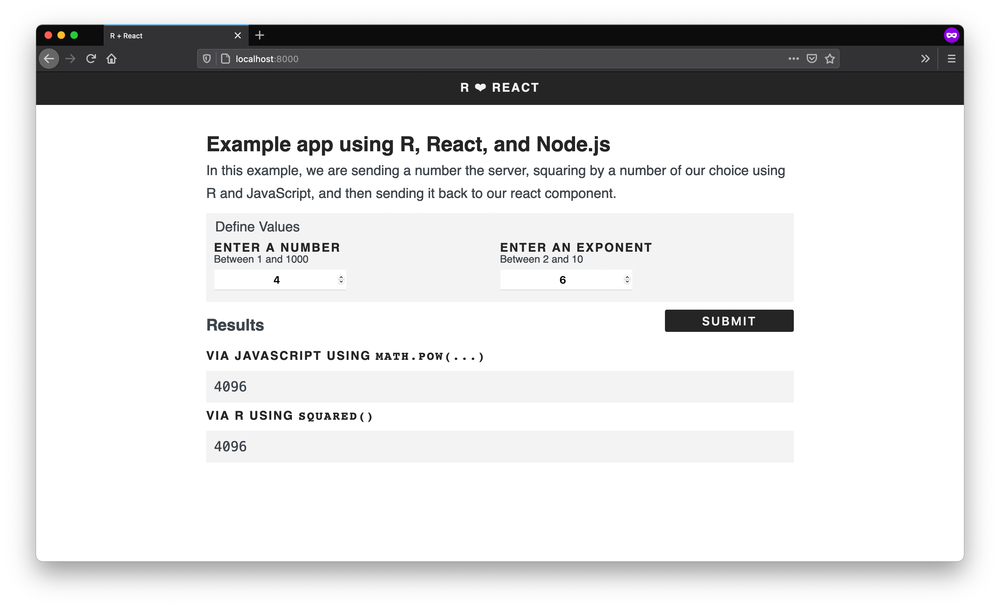

# R ❤️ React Demo application



The `r-react-demo` app demonstrates how to create a React application that uses R to process data server side. This is a fairly simple example, but it should provide a good starting point for your project. The app was built using the following tools.

- Frontend
  - [React](https://reactjs.org)
  - [Webpack](https://webpack.js.org)
- Backend
  - [Express](https://expressjs.com)
  - [r-script](https://github.com/fridgerator/r-script)

## Getting Started

### 1. Install Node and NPM

Make sure [Node and NPM](https://nodejs.org/en/) are installed on your machine. You may also use [Yarn](https://yarnpkg.com/en/). To test the installation or to see if these tools are already installed on your machine, run the following commands in the terminal.

```shell
node -v
npm -v
```

### 2. Clone the `r-react-demo` repository

```shell
git clone https://github.com/davidruvolo51/r-react-demo
```

### 3. Install dependencies

Next, install the npm packages that are required to run the app locally. I have decided to use [pnpm](https://github.com/pnpm/pnpm) to manage packages on my machine and across projects. To install `pnpm`, run the following command.

```shell
npm install -g pnpm
```

You will need to install the dependencies in the root directory and in the `client/` directory.

```shell
pnpm install

cd client
pnpm install
```

If you prefer to use `npm`, use the following.

```shell
npm install

cd client
npm install
```

### 4. Start the development servers

When everything is install, navigate back to the main directory and start the development server. This will start the client at port `localhost:8000` and the API at `localhost:5000`.

```shell
npm run dev
```

## Futher Reading

This application was built by piecing together a few blog posts. If you would like to start from scratch, checkout out the [How to create a React frontend and a Node/Express backend and connect them](https://www.freecodecamp.org/news/create-a-react-frontend-a-node-express-backend-and-connect-them-together-c5798926047c/) post.
